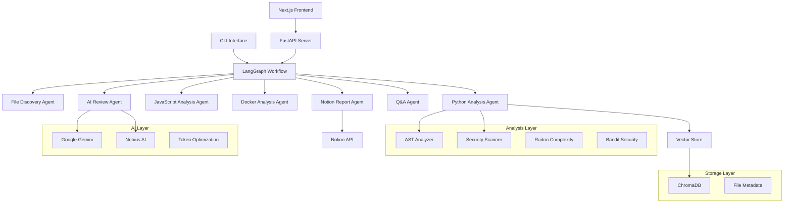

# CQ Lite Architecture Documentation

## System Overview

CQ Lite is a sophisticated, multi-agent code analysis platform that leverages AI orchestration, traditional static analysis, and modern web technologies to provide comprehensive code quality insights.

## High-Level Architecture



## Core Components

### 1. Multi-Agent Orchestration (LangGraph)

The system uses LangGraph to orchestrate multiple specialized agents:

#### Agent Workflow
```python
# Simplified workflow structure
workflow = StateGraph(CodeAnalysisState)

# Intelligent routing based on discovered files
workflow.add_conditional_edges(
    "file_discovery",
    route_language_analysis,
    {
        "python_analysis": "python_analysis",
        "javascript_analysis": "javascript_analysis", 
        "docker_analysis": "docker_analysis"
    }
)
```

#### State Management
```python
class CodeAnalysisState(TypedDict):
    # File discovery
    discovered_files: Dict[str, List[str]]
    file_metadata: Dict[str, Dict]
    
    # Analysis results
    all_issues: List[CodeIssue]
    python_issues: List[CodeIssue]
    
    # AI coordination
    analysis_strategy: Dict[str, any]
    ai_insights_complete: bool
    
    # Vector store integration
    skip_vector_store: bool
```

### 2. Intelligent File Discovery Agent

**Purpose**: Categorizes files by language and determines analysis strategy

**Key Features**:
- Language detection and categorization
- Smart file filtering (excludes test files, migrations, etc.)
- Analysis strategy determination based on project structure

```python
def file_discovery_agent(state: CodeAnalysisState) -> CodeAnalysisState:
    # Discover and categorize files
    discovered_files = {
        "python": find_python_files(target_path),
        "javascript": find_js_files(target_path),
        "docker": find_docker_files(target_path)
    }
    
    # AI-driven analysis strategy
    strategy = determine_analysis_strategy(discovered_files)
    
    return {
        "discovered_files": discovered_files,
        "analysis_strategy": strategy
    }
```

### 3. Language-Specific Analysis Agents

#### Python Analysis Agent

**Hybrid Approach**: Combines traditional AST analysis with AI enhancement

```python
async def python_analysis_agent(state: CodeAnalysisState):
    # Traditional analysis
    issues, metrics = await run_python_analysis(file_path)
    
    # AI enhancement
    ai_decisions = llm_model.generate_content(enhancement_prompt)
    
    # Token optimization
    enhanced_issues, file_metadata = merge_and_enhance_issues(
        issues, ai_decisions, file_path
    )
    
    # Vector store population
    add_to_vector_store(file_content, metadata)
    
    return enhanced_issues
```

**Analysis Components**:
- **AST Parser**: Structural analysis using Python's `ast` module
- **Complexity Analysis**: Radon for cyclomatic complexity metrics
- **Security Scanning**: Bandit for vulnerability detection
- **Secret Detection**: Custom patterns for hardcoded credentials
- **Performance Analysis**: Nested loop detection, inefficient patterns

#### JavaScript Analysis Agent

**Features**:
- Syntax validation using Esprima
- Performance pattern detection
- Security best practices checking
- Framework-specific optimizations

#### Docker Analysis Agent

**Features**:
- Dockerfile security scanning
- Base image vulnerability analysis
- Optimization recommendations
- Multi-stage build analysis

### 4. AI Review Agent

**Purpose**: Provides comprehensive, contextual code review using full codebase understanding

**Key Innovation - Token Optimization**:
```python
def read_codebase_context(discovered_files, file_metadata):
    for file_path in files:
        metadata = file_metadata.get(file_path, {})
        is_truncated = metadata.get('truncated', False)
        
        if is_truncated and metadata.get('description'):
            # Use AI-generated description + code gist
            code_gist = content[:100] + "..."
            codebase_context[file_path] = f"{description}\n\nCode gist: {code_gist}"
        else:
            # Use full content for important files
            codebase_context[file_path] = content[:3000]
```

**Benefits**:
- 20%+ token reduction through smart truncation
- Maintains architectural understanding
- Preserves code quality insights

### 5. Vector Store Integration (ChromaDB)

**Early Population Strategy**:
```python
def build_vector_metadata(file_path, content, metrics, ai_metadata):
    return {
        "file_path": file_path,
        "business_impact": ai_metadata.get("business_impact"),
        "architectural_concerns": ai_metadata.get("architectural_concerns"),
        "functions": metrics.functions,
        "classes": metrics.classes
    }

# Population happens during analysis, not after
add_to_vector_store(chunks, metadata)
```

**Q&A Enhancement**:
- Semantic search across codebase
- Context-aware responses
- Persistent knowledge base

### 6. Notion Integration Agent

**Purpose**: Automated documentation generation and publishing

**Features**:
- Executive summaries with metrics
- Issue prioritization matrices  
- Architectural insights and recommendations
- Developer-friendly formatting

**Retry Logic for Length Constraints**:
```python
def generate_report_with_retry(state, max_retries=3):
    retries = 0
    while retries < max_retries:
        try:
            report_data = generate_comprehensive_report(state)
            success = push_to_notion(report_data)
            if success:
                return report_data
        except Exception as e:
            # Retry with enforced brevity
            state["enforce_brevity"] = True
            retries += 1
```

## Design Decisions & Trade-offs

### 1. Multi-Agent vs Monolithic

**Decision**: Multi-agent architecture using LangGraph
**Reasoning**: 
- Specialized agents for different languages/concerns
- Parallel processing capabilities
- Better error isolation and recovery
- Easier to extend with new analysis types

**Trade-offs**:
- Added complexity in state management
- Requires careful orchestration
- More memory overhead

### 2. Token Optimization Strategy

**Decision**: Smart truncation with AI-generated descriptions
**Reasoning**:
- Significant cost reduction (20%+ token savings)
- Maintains code understanding for AI
- Preserves architectural context

**Implementation**:
```python
# Files are marked for truncation if:
# 1. No quality issues found
# 2. Low interdependency with other files  
# 3. AI confirms truncation won't affect analysis

if no_issues and low_dependency and ai_approval:
    metadata["truncated"] = True
    metadata["description"] = generate_file_description(content)
```

### 3. Vector Database Early Population

**Decision**: Populate vector store during analysis, not after
**Reasoning**:
- Enables immediate Q&A capability
- Leverages analysis context for better embeddings
- Reduces overall processing time

**Benefits**:
- Q&A agent has rich context from the start
- Analysis results are immediately searchable
- Better user experience with instant insights

### 4. Hybrid Analysis Approach

**Decision**: Combine traditional static analysis with AI enhancement
**Reasoning**:
- Static analysis provides reliable, fast detection
- AI adds contextual understanding and business impact
- Best of both worlds - precision and intelligence

**Example Enhancement**:
```python
# Traditional analysis finds complexity issue
traditional_issue = CodeIssue(
    title="High Complexity Function",
    description="Function has cyclomatic complexity of 15"
)

# AI enhancement adds business context
ai_enhancement = "This function is in the payment processing pipeline. High complexity here increases risk of financial errors. Consider breaking into smaller, testable units."

enhanced_issue = traditional_issue
enhanced_issue.suggestion += f"\n\n🤖 AI Enhancement: {ai_enhancement}"
```

## API Design

### RESTful Endpoints

```python
# GitHub repository analysis
POST /api/github/analyze
{
    "repo_url": "https://github.com/owner/repo",
    "model_choice": "gemini",
    "max_files": 20
}

# File upload analysis  
POST /api/upload
Content-Type: multipart/form-data

# Q&A interface
POST /api/chat
{
    "query": "What are the main security issues?",
    "context": "analysis_results"
}

# Real-time analysis status
GET /api/status/{job_id}
```

### WebSocket Integration

```python
# Real-time analysis progress
@app.websocket("/ws/analysis/{job_id}")
async def analysis_websocket(websocket: WebSocket, job_id: str):
    # Stream analysis progress and results
    await websocket.send_json({
        "stage": "python_analysis",
        "progress": 45,
        "current_file": "main.py"
    })
```

## Performance Optimizations

### 1. Parallel Agent Execution

```python
# Multiple language analyzers can run in parallel
if strategy.get("parallel_processing") and has_python and has_js:
    return "parallel_analysis"
```

### 2. Intelligent Caching

- Vector embeddings cached between runs
- File metadata preserved across sessions
- AI analysis results stored for incremental updates

### 3. Stream Processing

- Large files processed in chunks
- Real-time progress updates via WebSocket
- Memory-efficient analysis for large codebases

## Security Considerations

### 1. API Key Management
- Environment variable isolation
- No API keys in logs or responses
- Secure credential validation

### 2. File Upload Security
- File type validation
- Size limits and scanning
- Temporary file cleanup

### 3. Vector Store Security
- Local ChromaDB instance
- No sensitive data in embeddings
- Metadata sanitization

## Scalability Design

### 1. Horizontal Scaling
- Stateless agent design
- Database-backed job queue
- Load balancer compatibility

### 2. Resource Management
- Configurable analysis depth
- Memory-conscious processing
- Graceful degradation under load

## Future Architecture Enhancements

### 1. Plugin System
```python
# Extensible analyzer framework
class AnalyzerPlugin(ABC):
    @abstractmethod
    async def analyze(self, file_path: str) -> List[CodeIssue]:
        pass

# Register custom analyzers
register_analyzer("rust", RustAnalyzer())
register_analyzer("go", GoAnalyzer())
```

### 2. Distributed Processing
- Kubernetes deployment
- Message queue integration (Redis/RabbitMQ)
- Multi-region analysis

### 3. Advanced AI Integration
- Custom model fine-tuning
- Federated learning for code patterns
- Advanced reasoning chains

---

This architecture enables CQ Lite to provide intelligent, scalable, and cost-effective code analysis while maintaining excellent user experience and extensibility.
- **Quality**: Function length and complexity estimation

## Data Flow

1. **Code Input**: Files uploaded via web UI or analyzed via CLI
2. **Language Detection**: File extensions determine analyzer
3. **AST Analysis**: Code parsed into abstract syntax trees
4. **Issue Detection**: Multiple analyzers scan for problems
5. **Report Generation**: Results formatted for display
6. **AI Enhancement**: Gemini provides contextual insights

## Key Features

### AST-Based Analysis
- Deep structural understanding of code
- Accurate complexity measurements
- Precise duplication detection
- Security vulnerability identification

### Multi-Language Support
- Python: Full AST analysis with radon/bandit
- JavaScript/TypeScript: Syntax and pattern analysis
- Extensible architecture for additional languages

### AI Integration
- Contextual code understanding
- Natural language explanations
- Actionable improvement suggestions
- Conversational interface

### Modern UI/UX
- Dark gradient theme with accessibility
- Responsive design for all devices
- Interactive visualizations
- Real-time chat interface

## Technology Stack

- **Backend**: Python 3.11+, FastAPI, uvicorn, uv
- **Frontend**: Next.js 14, React 18, Tailwind CSS
- **AI**: Google Gemini Pro, Langgraph
- **Analysis**: AST, Radon, Bandit, Esprima
- **CLI**: Click, Rich for beautiful terminal output